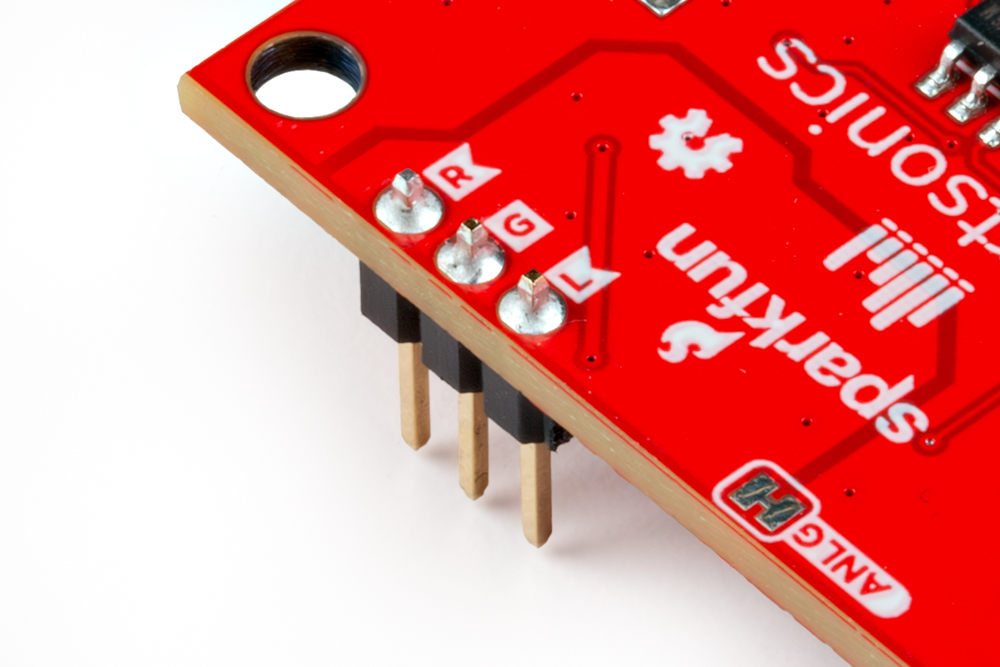
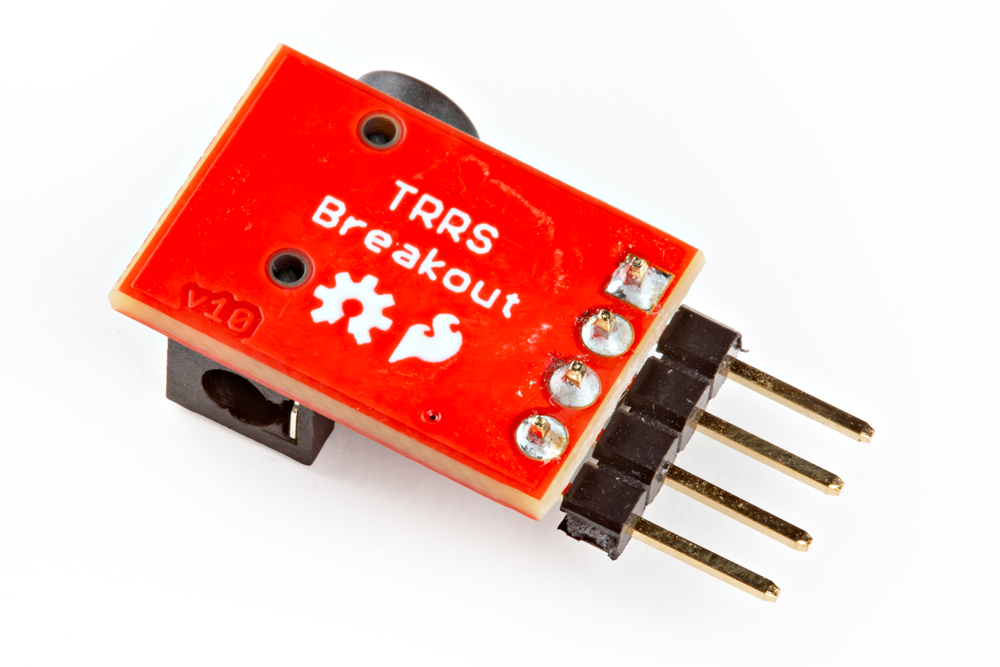
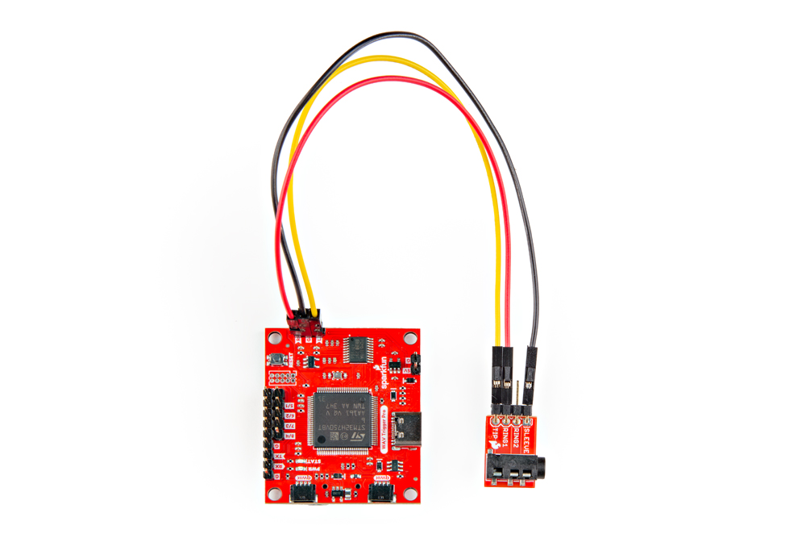

## Audio Output Pins (Required)

The audio output of the WAV Trigger Pro is routed to three 0.1"-spaced headers labeled <b>L</b>, <b>G</b> and <b>R</b>. This requires some through-hole soldering of either wires or headers to connect to your preferred audio output. For the purposes of this guide we'll be soldering headers to these pins to connect to a [SparkFun TRRS 3.5MM Jack Breakout](https://www.sparkfun.com/products/11570) to plug a pair of headphones into.

The WAV Trigger Pro requires soldering to these pins regardless of how it is configured and used so make sure to complete this step at some point during your preferred assembly.

### Soldering

??? note "New to soldering?"
	If you have never soldered before or need a quick refresher, check out our [How to Solder: Through-Hole Soldering](https://learn.sparkfun.com/tutorials/how-to-solder-through-hole-soldering) guide.
	

		<a href="https://learn.sparkfun.com/tutorials/5">
		 
        How to Solder: Through-Hole Soldering</a>
	

Start by locating the three-pin PTH header with the labels <b>R</b>, <b>G</b> and </b>L</b>. Depending on whether you prefer a permanent soldered connection or something removeable, solder either wire or male/female headers to these pins like the photo below shows with male headers soldered:

<figure markdown>
[{ width="600"}](./assets/img/WAV_Trigger_Pro-Audio_PTHs.jpg "Click to enlarge")
</figure>

If you're using the TRRS Breakout like we are, make sure to solder male/female headers or wire to the pins on that breakout like this:

<figure markdown>
[{ width="600"}](./assets/img/WAV_Trigger_Pro-TRRS_Breakout.jpg)
</figure>

### Wiring

Next connect the TRRS Breakout (or your preferred audio output) to the WAV Trigger's audio pins. Make the following connections if you're connecting the WAV Trigger to the TRRS 3.5mm Breakout:

<table>
    <tr>
        <th>WAV Trigger Pro</th>
        <th>TRR Breakout</th>
        <th>Color</th>
    </tr>
    <tr>
        <td>R</td>
        <td>RING1</td>
        <td>RED</td>
    </tr>
    <tr>
        <td>G</td>
        <td>SLEEVE</td>
        <td>BLACK</td>
    </tr>
    <tr>
        <td>L</td>
        <td>TIP</td>
        <td>YELLOW</td>
    </tr>
</table>

<figure markdown>
[{ width="600"}](./assets/img/WAV_Trigger_Pro-Audio_Assembly.jpg "Click to enlarge")
</figure>

## Serial Console Interface

The WAV Trigger Pro features a serial console interface that works over the board's RX/TX pins (<b>@3.3V Logic</b>) allowing users to connect a USB-to-Serial converter like the [Serial Basic Breakout - 3.3V USB-C](https://www.sparkfun.com/sparkfun-serial-basic-breakout-ch340c-and-usb-c.html) to send and receive information over that serial connection. The serial console works in all WAV Trigger Pro assembly options we cover in the following sections to provide helpful information about and control of the board.

### Serial Assembly

Connect to the serial console interface using the TX/RX and GND pins on the WAV Trigger Pro making sure to use either a 3.3V serial converter like the one linked above or by properly [level shifting](https://learn.sparkfun.com/tutorials/logic-levels) one that runs at a different logic to 3.3V. The table and photo below outline the connections between the WAV Trigger and Serial Basic Breakout - 3.3V:

<table>
    <tr>
        <th>WAV Trigger Pro</th>
        <th>Serial Basic</th>
        <th>Color</th>
    </tr>
    <tr>
        <td>TX</td>
        <td>RX</td>
        <td>ORANGE</td>
    </tr>
    <tr>
        <td>RX</td>
        <td>TX</td>
        <td>GREEN</td>
    </tr>
    <tr>
        <td>G</td>
        <td>GND</td>
        <td>BLACK</td>
    </tr>
</table>

<figure markdown>
[{ width="600"}](./assets/img/WAV_Trigger_Pro-Serial_Assembly.jpg "Click to enlarge")

After connecting the boards together, connect the Serial Basic to your computer over USB and connect the WAV Trigger Pro either over USB-C or another of the power inputs (Qwiic, 5V). Next, open the serial monitor in the Arudino IDE (or if you prefer, another terminal program) at <b>57.6k baud</b> with <b>Carriage Return</b> line ending enabled. 
 
Next, type in "help" (enter this and all other commands in <i>all</i> lowercase) and it will print out a list of available commands along with any available parameters to customize the command. Commands with just one parameter can be sent with a single space between the command and parameter. For commands with multiple parameters, separate the command and parameters using a comma. The list below outlines each command and what it does:

* <b>help</b> - Displays the available commands and their parameters
* <b>stat</b> - Returns a string that includes the WAV Trigger Pro's firmware version and build info as well as info about the &micro;SD card currently in the board
* <b>play</b> - Plays the specified track number (if it exists). If this command is sent with just one parameter the track plays at full volume, center panned, 0 pitch offset, attack and release times of 0ms and is not looped or locked. Use the optional additional parameters outlined in the "help" menu to customize the playback.
* <b>stop</b> - If sent with a track number, this stops the track immediately. The track fades out over the specified number of milliseconds before stopping if sent with a release value. If no track number is sent, this stops all tracks immediately.
* <b>gain</b> - Sets the output attenuation of the board.
* <b>v</b> - Returns the number of currently active voices.
* <b>sd</b> - When sent with no parameter, this returns the current longest &micro;SD block read in microseconds since the WAV Trigger Pro was powered on, reset or the value was reset. If sent with a parameter of 0, this resets the value manually.
* <b>test</b> - This command will stop the audio engine and start a block read timing test of the installed microSD card. The optional test count parameter can be used to specify the number of block read cycles in the test. If used with no parameter, the test will perform 100,000 block read cycles. It’s important to keep in mind that the test will only read blocks actually allocated to .wav files, so the more .wav files are on your card, the more of the card will be tested. While the test is running, a command of “r” can be used to see partial results, or “s” to stop the test prematurely. The audio engine will be restarted when the test finished or is stopped. For a detailed overview and discussion of the test performed here, refer to [this article](https://www.robertsonics.com/blog/microsd-cards-for-audio-2024)