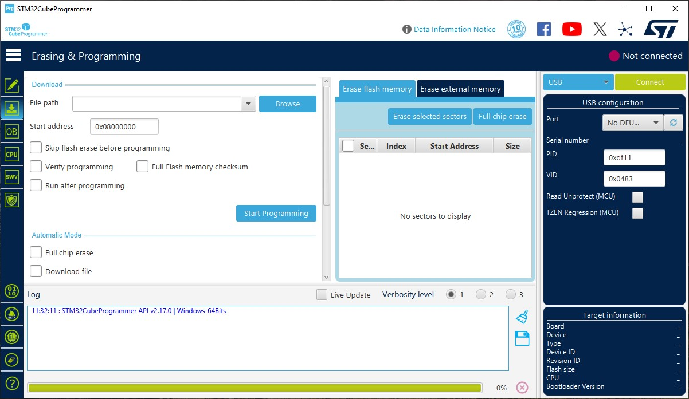
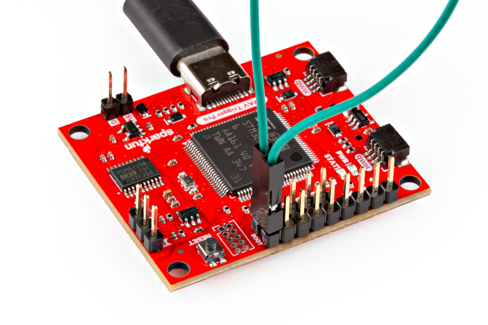
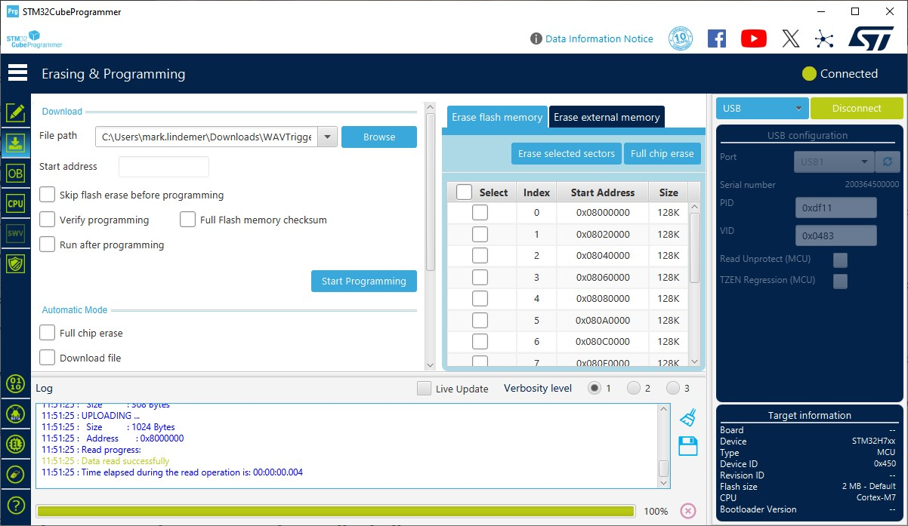

The Qwiic WAV Trigger Pro comes pre-loaded with firmware to use it as a MIDI device but, as covered previously, the WAV Trigger Pro can be used as either a MIDI device or MIDI host with the approrpiate firmware. In the future, there may be updates to the WAV Trigger Pro's firmware users can upload to the board if necessary. In this section we'll go over how to upload the MIDI Host firmware to the board but these steps also work for updating or reverting firmware versions.

## STM32 CubeProgrammer Software

Uploading new firmware is best done using the [STM32 CubeProgrammer](https://www.st.com/en/development-tools/stm32cubeprog.html) software. You can upload new firmware to the board over USB, USB-to-Serial converter like the [Serial Basic]() connected to the serial PTH pins, or with an STLink debugger and the SWD header. We strongly recommend uploading over USB since all you need is a USB-C cable, closing the BOOT jumper/tying BOOT to GND, and a computer with the STM32 Cube Programmer software. This guide only covers uploading new firmware over USB-C.

Start by downloading the CubeProgrammer software for your operating system from [this page](https://www.st.com/en/development-tools/stm32cubeprog.html). Note, downloading does require submitting a valid e-mail and clicking a confirmation link sent to that e-mail. Once downloaded, follow the installation instructions and then open Cube Programmer and you should be greeted by a screen similar to the image below:

<figure markdown>
[{ width="600"}](./assets/img/Cube-Connected.jpg "Click to enlarge")
</figure>

## Updloading New WAV Trigger Firmware 

All versions of the WAV Trigger Pro firmware are hosted on robertsonics' [downloads page](https://www.robertsonics.com/downloads/) under the "WAV Trigger Pro" header. The WAV Trigger Pro ships with the MIDI Device Firmware so let's take a look at uploading the MIDI Host Firmware.

### MIDI Host Firmware 

Start by downloading the MIDI Host firmware from robertsonics' [downloads page](https://www.robertsonics.com/downloads/). Take note of where that downloads to as we'll need to direct the STM32 CubeProgrammer software to that file.

### BOOT Jumper

Prior to connecting the WAV Trigger Pro to your computer, close the BOOT PTH jumper (either using headers and a jumper connector/jumper wire or simply temporarily pulling BOOT to GND) to set the STM32 into BOOT Mode. The board should stay in BOOT mode until reset or power cycle. The photo below shows the BOOT jumper closed using a jumper wire plugged into male headers on the board:

<figure markdown>
[{ width="600"}](./assets/img/WAV_Trigger_Pro-BOOT_Jumper.jpg "Click to enlarge")
</figure>

### Upload New Firmware

With the board in BOOT mode, return to the Cube Programmer software and switch to the "Erasing & Programming" view by clicking the second icon on the left side of the window. Next, either enter the filepath for the new firmware or click "Browse" to naivgate to the firmware file. On the right side of the window, select "USB" on the drop-down menu for programmer type. The USB port <i>should</i> automatically detect which port the WAV Trigger is on but if not, click the refresh button and manually select the port, then click "Connect".

<figure markdown>
[{ width="600"}](./assets/img/Cube-Connected.jpg "Click to enlarge")
</figure>

Make sure everything is configured properly and then click "Start Programming" to begin uploading the new firmware. This should take only a few seconds and once it's complete, disconnect the BOOT jumper (if needed) and press the RESET button. The WAV Trigger Pro should now appear as a USB audio device.