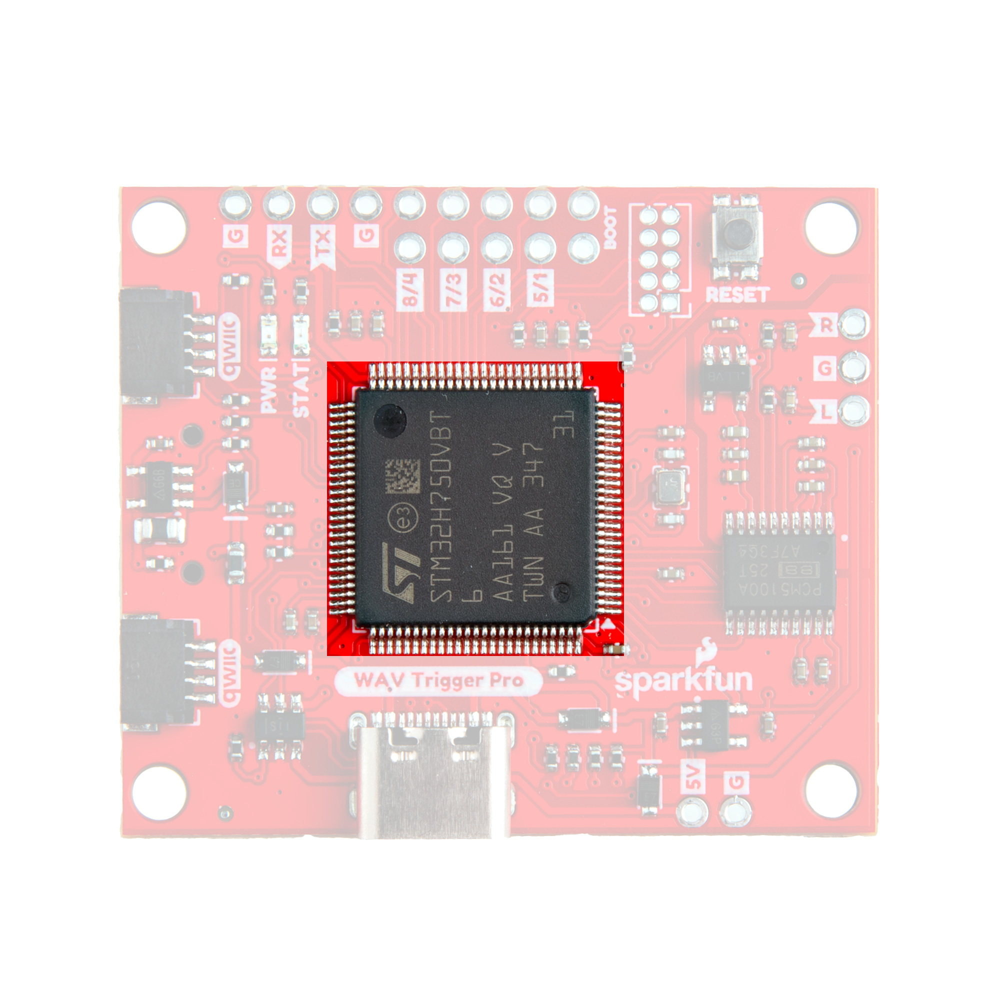
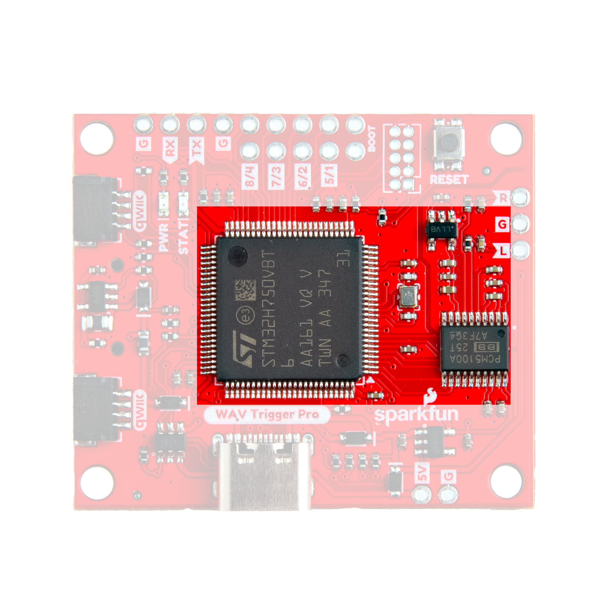
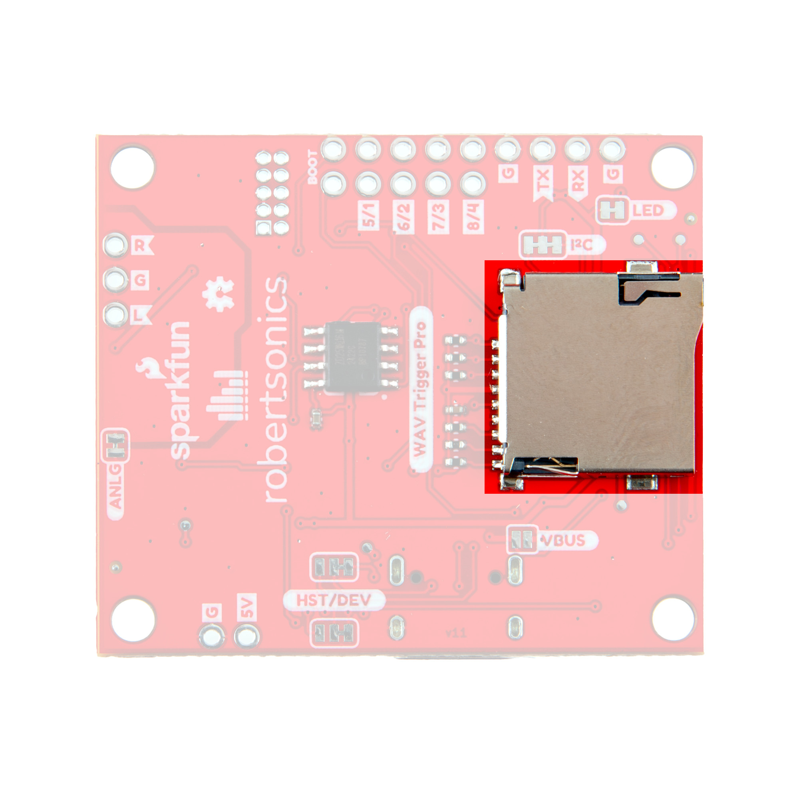
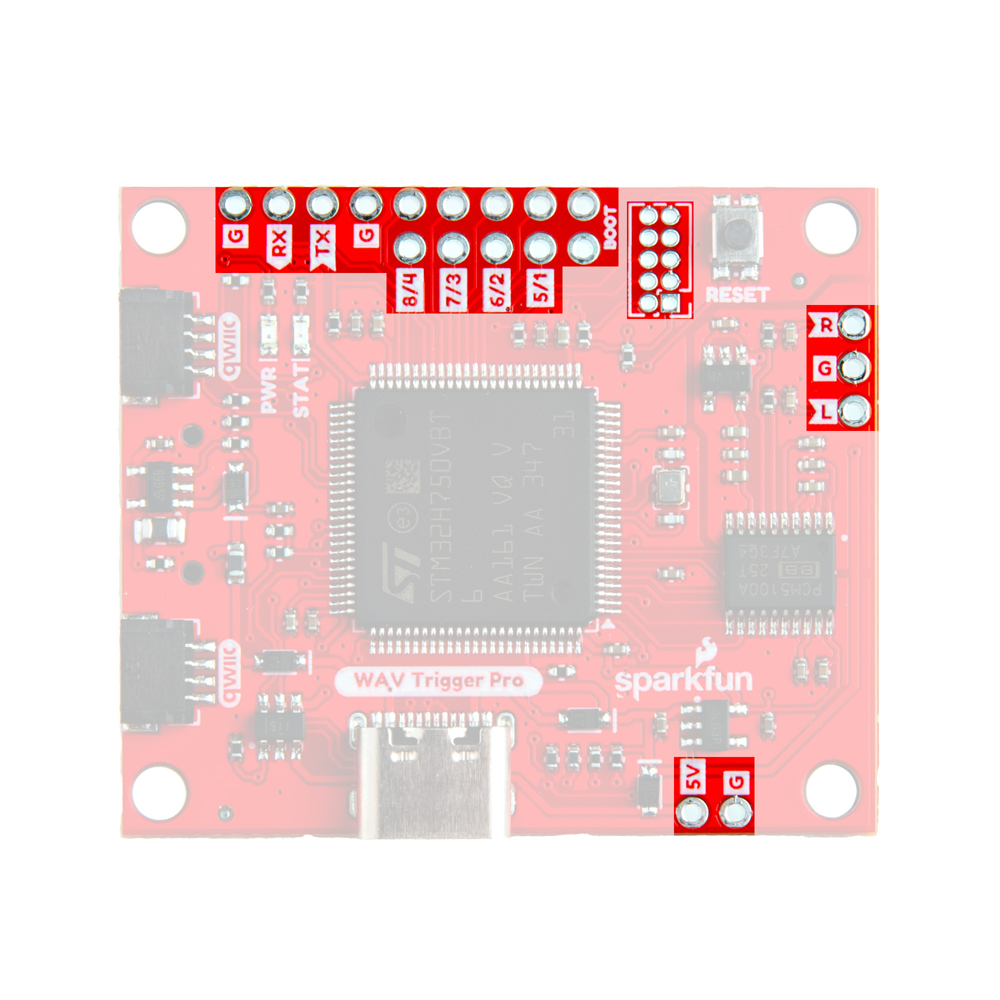
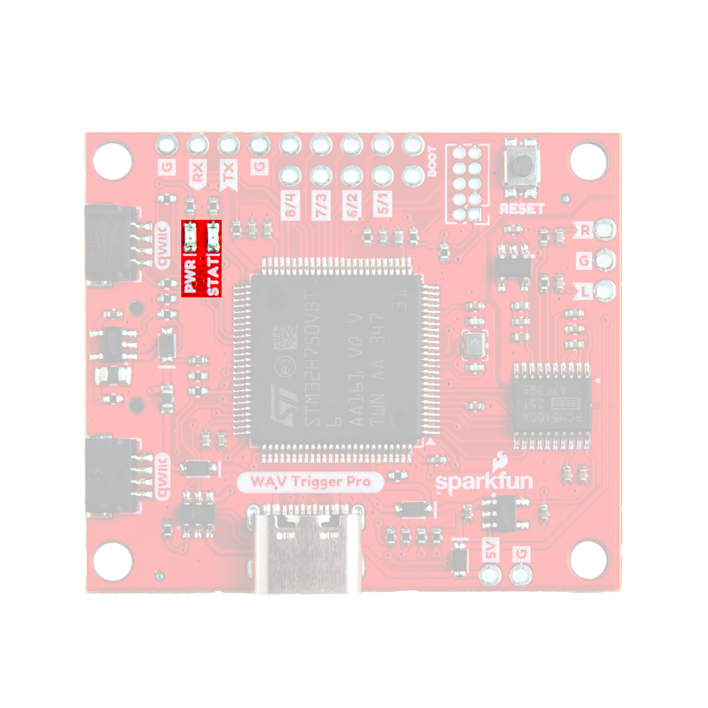
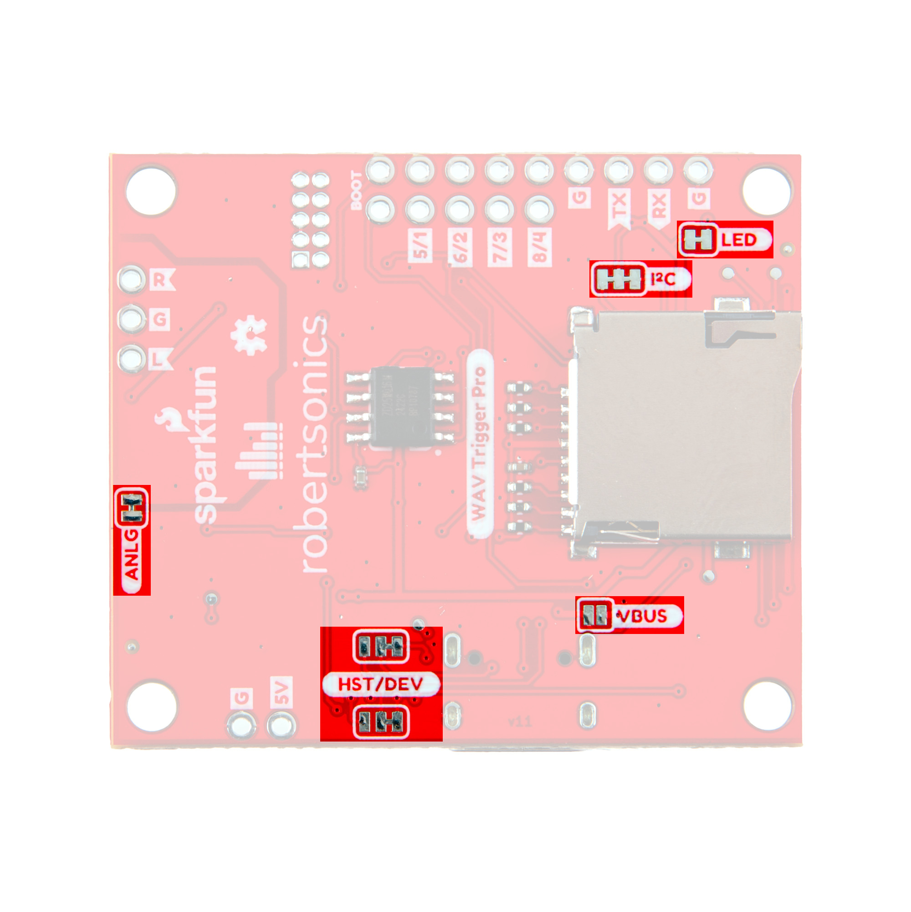
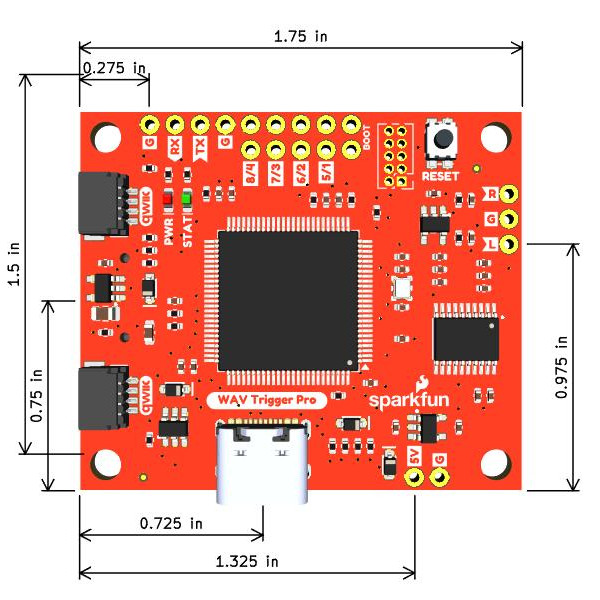

In this section we'll take a closer look at the components on the WAV Trigger Pro (Qwiic).

## STM32H Microcontroller

The WAV Trigger Pro uses the STM32H750VBTx central processor from ST Microelectronics&copy;.  

<figure markdown>
[{ width="600"}](./assets/img/WAV_Trigger_Pro-STM32.jpg "Click to enlarge")
</figure>

The STM32 features a 32-bit Arm&reg; Cortex&reg;-M7 core with 128 Kb of Flash memory and 1Mb of RAM. It has an integrated USB converter that allows for easy updating of firmware over the USB-C connector on the board using STM's [Cube Programmer](https://www.st.com/en/development-tools/stm32cubeprog.html) tool. Updating the WAV Trigger Pro's firmware is covered in more detail in the [Updating Firmware](./firmware.md) section of this guide.

## Power Inputs

The WAV Trigger Pro has three options for powering the board; USB-C, Qwiic, or dedicated through-hole pins.

<figure markdown>
[{ width="600"}](./assets/img/WAV_Trigger_Pro-Power.jpg)
</figure>

### USB-C

The USB-C connector on the board provides both a serial connection along with a power input. By default, when plugging the board in over USB-C to a computer, it will appear as a USB MIDI Device. When the WAV Trigger Pro is configured to act as a USB MIDI Host and powered through the dedicated through-hole power pins, the USB-C connector can supply <b>500mA@5V</b> to a connected USB MIDI device. Running the WAV Trigger Pro as a USB MIDI Host requires uploading alternate firmware as well as modifying the appropriate solder jumpers. Read on to the [MIDI Host Assembly](./midi_host.md) section for detailed information on this configuration.

### Qwiic Connector

The board includes a pair of Qwiic connectors to integrate it into SparkFun's [Qwiic ecosystem](https://www.sparkfun.com/qwiic). These connectors provide both an I2C connection as well as power (<b>3.3V</b>) to the WAV Trigger Pro. The WAV Trigger Pro Arduino library works over I2C to control the board using an Arduino microcontroller.

### Through-Hole Power Pins

This pair of 0.1"-spaced plated through-hole (PTH) pins labeled <b>5V</b> and <b>GND</b> accept a supply voltage of <b>5V</b>. This power input is primarily intended for running the WAV Trigger Pro as a USB MIDI Host to provide <b>5V/500mA</b> to a MIDI device connected to the board's USB-C connector.

## Polyphonic Engine

The operation of the WAV Trigger Pro's polyphonic engine is proprietary to [Robertsonics](https://www.robertsonics.com). While we cannot go into exact details on how this works, here are some highlights of the engine's functionality:

<figure markdown>
[{ width="600"}](./assets/img/WAV_Trigger_Pro-Audio_Engine.jpg)
</figure>

* Up to 4096 uncompressed 16-bit, 44.1kHz mono and stereo WAV files (CD Quality)
* Polyphonic - Play and mix up to 24 tracks independently and simultaneously with independent pitch control
* Low Latency - Timing from triggering a track to playback typically takes only 2.5ms (4ms max)
* MIDI notes can trigger up to 8 independent actions, routing tracks to any combination of outputs
* Up to 8 velocity range assignments per note to trigger alternate samples
* Each event provides independent pitch offset (in cents) allowing for true multi-sampling
* Seamless looping over arbitrary track length

### MIDI Control

The WAV Trigger Pro introduces MIDI-USB host and device capabilities. The board can function as either a USB-MIDI device or USB-MIDI host. When acting as a USB-MIDI host and powered independently it can power a connected MIDI device with <b>500mA@5V</b>. This means you can have complete USB-MIDI interactivity with the WAV Trigger Pro with <i>no</i> computer required! Do note, running the WAV Trigger Pro as a MIDI-USB host requires uploading alternate firmware as well as physically adjusting the appropriate solder jumpers. Read on to the "MIDI Host Assembly" section for complete instructions.

### Trigger Control

The board also includes eight independent trigger inputs routed to through-hole pins. All eight trigger pins can be individually configured. All trigger pins a <b>3.3V</b> tolerant.

### Qwiic (I2C) Control

This WAV Trigger also includes a pair of Qwiic connectors to integrate with SparkFun's [Qwiic ecosystem](https://www.sparkfun.com/qwiic). Users can use this in tandem with the [WAV Trigger Pro Arduino Library]((https://github.com/robertsonics/WAV_Trigger_Pro_Qwiic_Arduino_Library) to control the WAV Trigger Pro using an Arduino development board.

### Audio Output

The WAV Trigger Pro has two channels for audio output routed to through-hole pins. Soldering to these pins is required for the audio output to work properly. If you have never soldered before or want some tips, check out our [How to Solder: Through Hole Soldering Tutorial](https://learn.sparkfun.com/tutorials/how-to-solder-through-hole-soldering).

### Presets

The WAV Trigger Pro introduces <i>Presets</i>! Presets are managed through spreadsheet .csv files (Excel or Google Sheets) loaded onto a connected &micro;SD card which describe up to 8 actions per MIDI note, based on channel and velocity. Each action can start and independent track with individual gain, balance, attack, release, and pitch. This allows multiple sounds to be mixed in performance. If you've used previous WAV Triggers before, these Preset files take the place of the configuration app. You can have multiple presets stored on the file that you can switch between. Read on to the [Preset File](./preset.md) section of this guide for detailed information on how to setup and use these files.

## &micro;SD Card Slot

The &micro;SD card holder on the WAV Trigger Pro is on the back/reverse side of the board. This card is used to store <code>.wav</code> audio files and preset <code>.csv</code> files. 

<figure markdown>
[{ width="600"}](./assets/img/WAV_Trigger_Pro-SD.jpg "Click to enlarge")
</figure>

## PTH Pins

The Qwiic WAV Trigger Pro has several plated through-hole (PTH) headers around the board. Let's take a closer look at each of these headers and how they work.

<figure markdown>
[{ width="600"}](./assets/img/WAV_Trigger_Pro-PTHs.jpg) "Click to enlarge"
</figure>

### Trigger Pins

The board has eight PTH trigger pins mapped to the first 8 MIDI notes meaning activating Trigger pin 1 sends a MIDI Note-on message for note 1 and releasing Trigger pin 1 sends a MIDI-Note-off message for note 1. The trigger pins pulled HIGH to 3.3V internally and are active LOW. Pulling them to ground through either a button, switch, relay, or active output (eg. microcontroller I/O pin) activates the trigger. 

All trigger pins are <b>3.3V</b> tolerant so if you're using an active output to control the triggers make sure the inactive state of the triggers does not exceed 3.3V. Users can adjust how these trigger inputs behave in the Preset file. Read on to the [Preset File](./preset.md) of this guide for more information on configuring the triggers and other MIDI note behavior.

### Audio Output

The WAV Trigger Pro has two channel (stereo) output routed <i>only</i> to PTH pins labeled <b>L</b>, <b>R</b>, and <b>G</b>.

### Serial/UART & Boot Pins

The STM32's serial UART (RX/TX) pins and BOOT pin are routed to PTHs. Connecting the BOOT pin to ground puts the STM32 into BOOT mode for uploading new firmware to the board over either USB-C or a serial connection. The BOOT pin is routed directly next to a Ground pin to make closing this pin jumper easy. The UART pins operate at <b>3.3V logic</b>.

The WAV Trigger Pro firmware (both Device & Host) also sets these pins up to be used with as a serial console interface  over a [serial terminal](https://learn.sparkfun.com/tutorials/terminal-basics) like the Arduino Serial monitor. The serial console accepts ASCII commands to as play, loop and stop tracks, loading presets and also return device status which can help provide important information about a connected &micro;SD card's performance. The serial console interface works simultaneously with everything else running on the board. Read on to the [Audio Output & Serial Console Interface](./audio.md) section of this guide for more information.

### STM SWD Header

The board includes a 5x2 Software Debug (SWD) header for low-level debugging of the STM32. The header connects to the STM32's SWD pins: SWDIO, SWCLK & SWO. For more information about using the SWD interface, refer to the STM32's [Datasheet](./assets/component_documentation/stm32h750ib.pdf), [Reference Manual](./assets/component_documentation/dm00314099-stm32h742-stm32h743-753-and-stm32h750-value-line-advanced-arm-based-32-bit-mcus-stmicroelectronics.pdf) & [Hardware Development App Note](./assets/component_documentation/an4938-getting-started-with-stm32h74xig-and-stm32h75xig-mcu-hardware-development-stmicroelectronics.pdf).

### Power Input

When not using USB or Qwiic for power, connect a <b>5V</b> supply to power the board. 

## LEDs

The board has two LEDs on board labeled <b>PWR</b> and <b>STAT</b>. 

<figure markdown>
[{ width="600"}](./assets/img/WAV_Trigger_Pro-LEDs.jpg "Click to enlarge")
</figure>

The red <b>PWR</b> LED indicates whenever the board is powered. The green STAT LED provides helpful information on the current status of the WAV Trigger. On reset, the STAT LED blinks in the following patterns:

* 3 Quick Blinks - No problems. Both the &micro;SD card and WAV files were found
    * After the initial pattern, the STAT LED will flash quickly every couple seconds as a "Heartbeat"
    * Goes solid while audio is playing
* 1 Long then 1 Short Blink (Repeating) - No &micro;SD card found
* 1 Long then 2 Short Blinks (Repeating) - File system error
* 1 Long then 3 Short Blinks (Repeating) - No WAV Fils found on &micro;SD card
* 1 Long then 4 Short Blinks (Repeating) - Memory error

## Solder Jumpers

The WAV Trigger Pro has six solder jumpers labeled <b>HST/DEV</b>, <b>VBUS</b>, <b>ANLG</b>, <b>I2C</b> and <b>LED</b>. 

<figure markdown>
[{ width="600"}](./assets/img/WAV_Trigger_Pro-Jumpers.jpg "Click to enlarge")
</figure>

The list below outlines their names, functionality, default states and any notes on their use.

* <b>HST/DEV</b> - This pair of three-way solder jumpers work with the <b>VBUS</b> jumper to switch the functionality of USB-MIDI control between acting as a Device or Host. The HST/DEV jumpers default to set the board to act as a MIDI Device.1
* <b>VBUS</b> - This jumper controls whether the USB-C connector accepts or supplies 5V. It is OPEN by default to use the USB-C connector to receive power from a USB-C source. Closing it nets the output from VIN (5V/GND PTHs) to VUSB so the USB-C connector <i>outputs</i> 5V to a device connected to it.1  
* <b>ANLG</b> - This jumper ties the audio output's ground to the common ground on the board. It is CLOSED by default. Open it to isolate the audio's ground from the rest of the WAV Trigger Pro's ground plane.
* <b>I2C</b> - Pulls the SDA/SCL lines to <b>3.3V</b> through a pair of <b>2k&ohm;</b> resistors. It is CLOSED by default. Open it to disable pullup on the I2C bus.
* <b>LED</b> - Completes the Power LED circuit. CLOSED by default. Open it to disable the Power LED to help reduce the current draw.

!!! note "Note 1: HST/DEV & VBUS Jumpers"
    How to use and set these jumpers is covered in more detail in the [MIDI Host Assembly](./midi_host.md) section of this guide.

## Board Dimensions

The Qwiic WAV Trigger Pro measures 1.5" x 1.75" (38.10mm x 44.45mm) with four mounting holes that fit a [4-40 screw](https://www.sparkfun.com/products/10453).

<figure markdown>
[{ width="600"}](./assets/board_files/SparkFun_Qwiic_WAV_Trigger_Pro-Dimensions.jpg "Click to enlarge")
</figure>