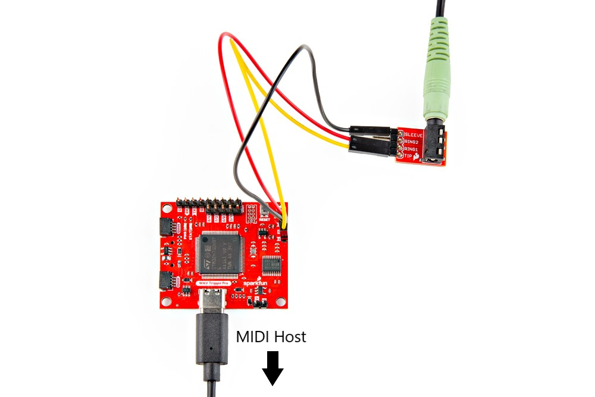

With the default firmware, the WAV Trigger Pro acts as a MIDI Device and can be controlled from a MIDI Host over USB. Simply plug the board into your keyboard or other MIDI controller and start playing. You can also use your computer with a Digital Audio Workstation (DAW) software like [MIDI-OX](https://www.midiox.com) to route incoming MIDI messages from your keyboard to the WAV Trigger Pro.

<figure markdown>
[]
</figure>