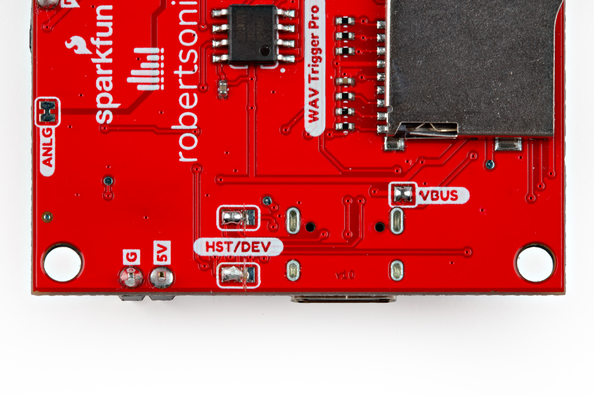
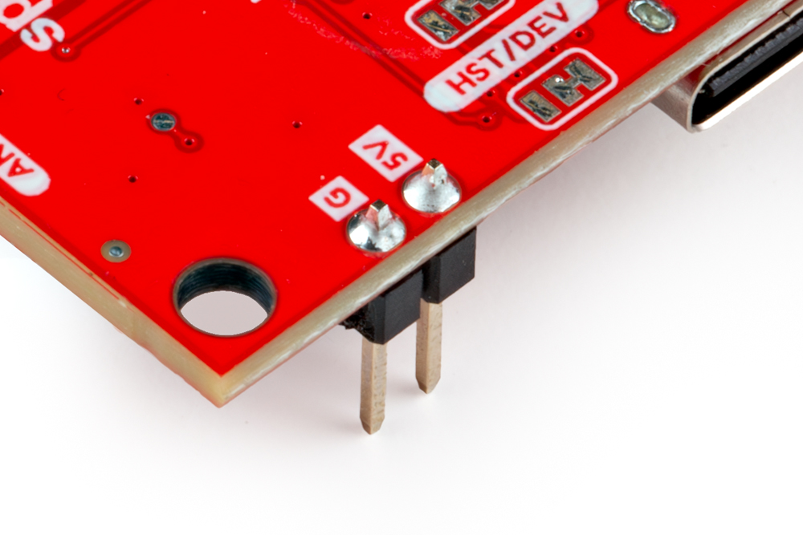
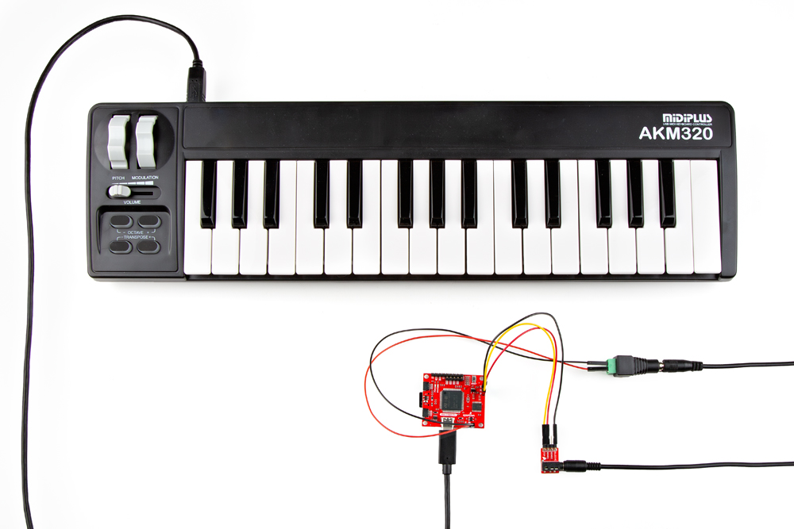

## MIDI Host Firmware

Running the WAV Trigger Pro as a MIDI USB Host requires uploading the proper firmware. Before setting up the WAV Trigger Pro to act as a MIDI Host, refer to the [Updating Firmware](./firmware.md) section for detailed instructions on uploading the MIDI Host firmware. 

## Hardware Adjustments

Now we need to adjust the HST/DEV solder jumpers to configure the board to act as a USB Host. Locate these jumpers on the underside of the board and sever the trace connecting the "Center" and "Right" pads and then carefully solder the "Center" and "Left" pads together. Next, close the VBUS jumper by soldering the two pads together. After adjusting these jumpers your board should look similar to the photo below:

<figure markdown>
[{ width="600"}](./assets/img/WAV_Trigger_Pro-MIDI_Host_Jumpers.jpg "Click to enlarge")
</figure>

Next, prepare to connect the power supply for the MIDI assembly by either soldering wires directly to the <b>5V</b> and <b>GND</b> pins or soldering headers to these pins for a removeable power connection. We opted for headers to make a temporary power connection shown in the photo below:

<figure markdown>
[{ width="600"}](./assets/img/WAV_Trigger_Pro-Audio_PTHs.jpg "Click to enlarge")
</figure>

## Completed Assembly

Now that the WAV Trigger Pro is set up to act as a MIDI host, connect your MIDI device to the WAV Trigger Pro over USB-C. We used this [USB MIDI Keyboard](https://www.amazon.com/midiplus-32-Key-Midi-Controller-AKM320/dp/B00VHKMK64?th=1) connected to the board using a USB Type-C to USB Type-B cable. With that plugged in, connect the WAV Trigger Pro to a 5V power supply and it should end up looking something like this:

<figure markdown>
[{ width="600"}](./assets/img/WAV_Trigger_Pro-MIDI_Host_Assembly.jpg "Click to enlarge")
</figure>

