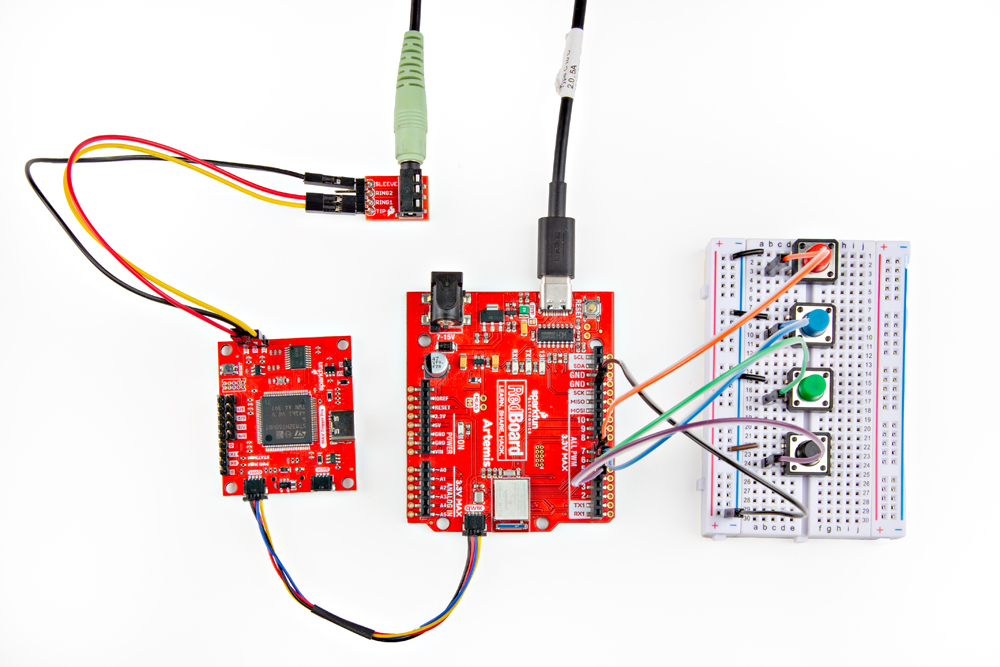

The Qwiic WAV Trigger Pro can be controlled over a Qwiic (I2C) connection with a development board using the WAV Trigger Pro Qwiic Arduino Library. The Qwiic interface works with the WAV Trigger Pro running either MIDI Device (default) or MIDI Host firmware. 

## Qwiic Assembly

Using the WAV Trigger Pro over Qwiic is simple as it just requires a connection to a Qwiic-enabled development board using a Qwiic cable. If your preferred development board does not have a Qwiic connector, you can use this [Qwiic breadboard adapter cable](https://www.sparkfun.com/products/17912) to connect to the I2C bus.

<figure markdown>
[{ width="600"}](./assets/img/WAV_Trigger_Pro-Qwiic_Assembly.jpg "Click to enlarge")
</figure>
