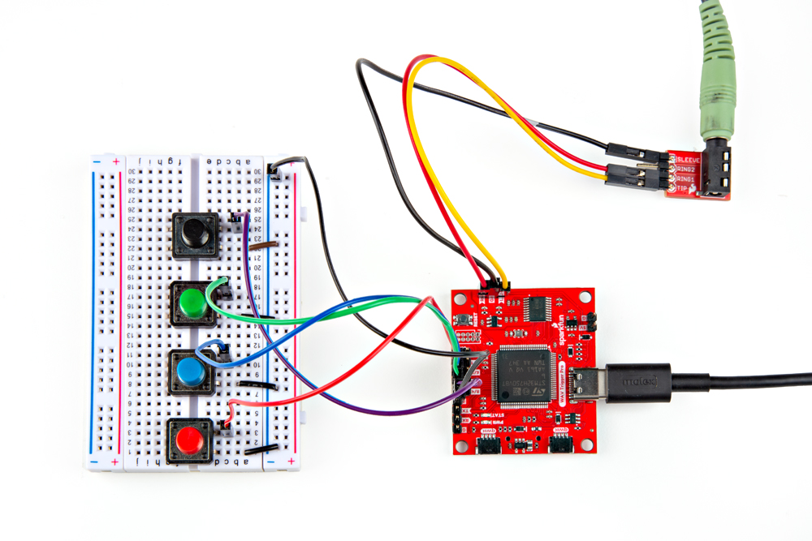

## Preparing Trigger Pins

The WAV Trigger Pro has eight trigger pins routed to 0.1"-spaced headers that can be used to trigger MIDI playback for the first eight MIDI notes defined by the Preset file. If you're using these pins we recommend soldering either wire to whatever input you decide to use (button, switch, etc.) or if you'd like a removeable connection you can solder headers to these pins like the photo below:

**Photo of trigger pins soldered - Mark L**

## Trigger Breadboard Assembly

For the purposes of this guide, we wired the first four trigger inputs to four push-buttons on a breadboard for a quick demo on using these inputs. Make sure to create a common ground by connecting a wire from one of the WAV Trigger Pro's ground pins to the ground rail on the breadboard and then wire each button to a trigger pin and the breadboard's ground rail like the photo below shows: 

<figure markdown>
[{ width="600"}](./assets/img/WAV_Trigger_Pro-Trigger_Assembly.jpg "Click to enlarge")
</figure>